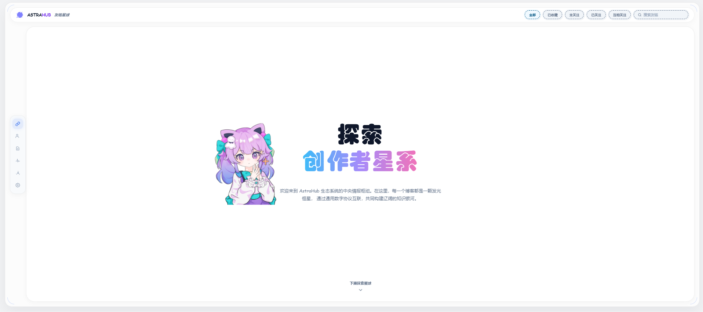
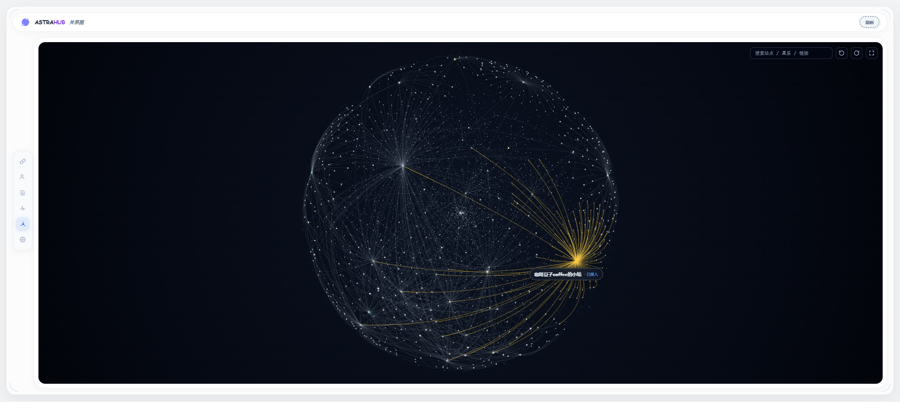
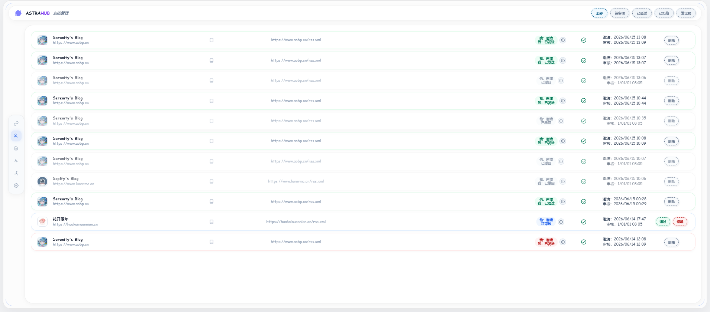
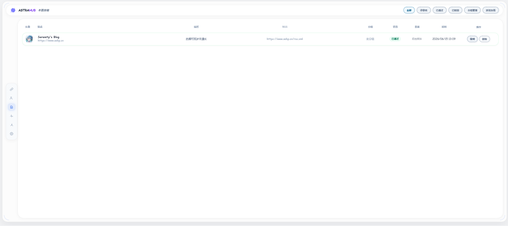
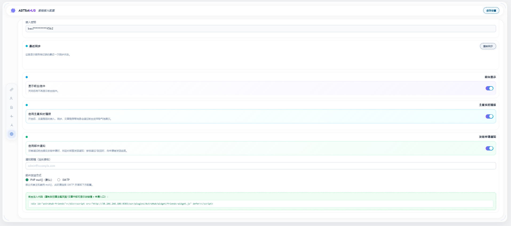
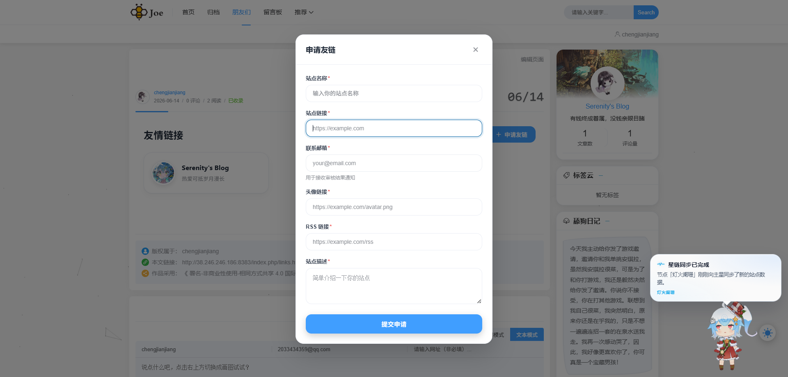
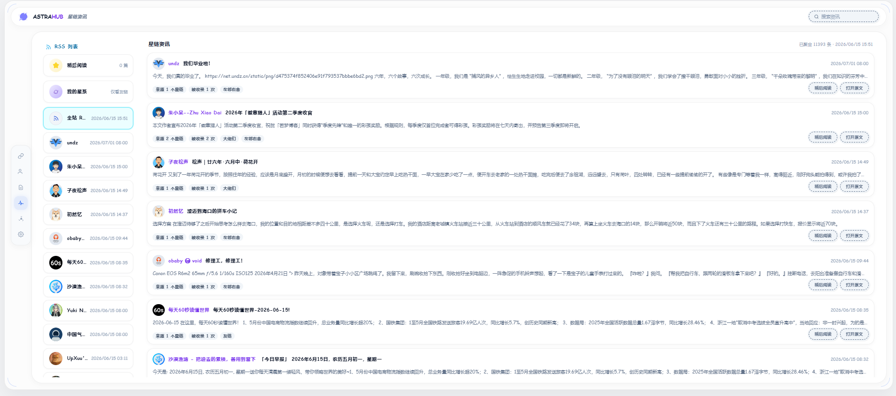

# AstraHub 星链插件（Typecho）

[](https://www.gnu.org/licenses/agpl-3.0)
[](https://typecho.org)
[](https://www.php.net)

> 📖 项目背景与设计理念详见：[AstraHub：让独立博客重新连接起来](https://www.aobp.cn/archives/AstraHub)

## 介绍

每个独立博客都有自己的友链页，上面链着几个朋友，朋友又链着他们的朋友。但这些关系只存在于单个站点里，没有谁把它们串起来看。

AstraHub（中文叫「星链」）做的就是这件事：**把分散在不同博客上的友链关系、节点身份和公开动态串成一张可探索的关系网络**。

它不是又一个友链展示页。传统的友链管理是"我这个站挂了谁"，AstraHub 关心的是"几百个站连起来之后长什么样"——谁和谁互链了，哪些圈子天然抱团，哪些博主气质相近但还没发现彼此。

本插件让你的 Typecho 站点接入 AstraHub 生态：在线交换友链、沿关系网发现同好、把好内容串联起来共同放大。

## 生态接入进展

AstraHub 的目标是打破不同博客系统之间的孤岛，让各类生态的站点接入同一张关系网络。目前进展：

| 生态 | 状态 |
| --- | --- |
| Halo | ✅ 已接入 |
| Typecho | ✅ 已接入（本插件） |
| WordPress | 🚧 适配中，即将上线 |
| 更多生态 | 📮 持续扩展 |

不同生态的站点接入后，身份、友链与公开动态在同一张网络中互通——Halo 站点可以和 Typecho 站点在线互换友链，关系图与资讯流跨生态聚合，不受底层博客系统限制。

## 已实现能力

- **站点接入与身份**：邀请码注册、凭证加密存储、换域名/搬家后重新登舱恢复身份。
- **友链邀请协议**：跨站发起 / 审核 / 撤回 / 解除友链，双向关系实时同步，后台实时红点提醒。
- **本地友链管理**：自带友链表 CRUD、分组管理、访客前台申请与后台审核，审核通过即时上报星链。
- **友链星球**：聚合探索全网接入站点，按互关 / 关注 / 可邀请等关系筛选与搜索。
- **关系图谱**：交互式可视化站点之间的友链与圈层关系。
- **资讯聚合**：基于全网 RSS 的文章聚合浏览与搜索。
- **前台组件**：自动注入的星链挂件（含吉祥物与动态播报）与可嵌入任意主题的友链墙。

## 界面预览

| 友链星球 | 关系图谱 |
| --- | --- |
|  |  |

| 友链管理 | 本地友链 |
| --- | --- |
|  |  |

| 接入配置 | 前台挂件 |
| --- | --- |
|  |  |

| 资讯聚合 | |
| --- | --- |
|  | |

## 特色

- **连接价值**
  把原本分散的独立博客连接起来，形成真实可见的博客关系网络。每一条友链都成为图谱中的一条边，被全网共同读取、共同放大。

- **发现价值**
  不再一个个手动寻找友链或圈层，直接从图谱、标签和节点关系中发现你想要的博客与创作者。

- **曝光价值**
  接入生态的节点越多，每个博客获得的可见度越高，出现在更多关系链、动态流和检索结果中。

- **交换友链新范式**
  告别跑到对方网站找入口、填表单、等回信的旧流程。看到心仪的博客直接发起友链申请，对方一键审核通过，双向友链同步生效。

- **关系图谱**
  内置交互式关系图，把站点之间的友链与圈层关系可视化，一眼看清谁在你的圈层里、谁处在网络枢纽位置。

- **本地友链管理**
  自带友链表 CRUD 与分组管理，开放访客前台申请并在后台审核，审核通过即时同步到星链。

- **资讯聚合**
  基于全网 RSS 的文章聚合浏览与搜索，沿着圈层读到更多好内容。

- **主题嵌入**
  附带前台星链挂件与友链墙组件，任意 Typecho 主题加一行引用即可使用，无需改动主题代码。

## 系统要求

- Typecho `>= 1.2.0`
- PHP `>= 7.4`，需 `hash`、`openssl` 扩展，推荐启用 `curl`
- 服务器可经 HTTPS 出站访问 Hub，系统时钟与 UTC 偏差 < ±60 秒

## 安装

1. 从 [Releases](https://github.com/atangccc/Astrahub-typecho/releases) 下载最新发行包。
2. 解压后将整个目录放入 Typecho 插件目录，并确保**目录名为 `AstraHub`**：

   ```
   usr/plugins/AstraHub/
   ```

3. 进入后台 **控制台 → 插件**，启用「AstraHub 星链」。启用时会按当前数据库类型自动建表。

> 发行包已内置前端构建产物，无需自行构建即可使用。

## 配置

启用后在左侧菜单进入 **AstraHub 星链 → 接入配置**：

- 填写 Hub 地址（默认 `https://astra.aobp.cn`）与站点信息，注册获取站点身份。
- 站点搬家或换域名后，可重新登舱恢复在网络中的身份，原有友链关系与圈层归属保留。

## 主题嵌入

### 星链挂件（自动）

星链挂件（含吉祥物与动态播报）通过页脚钩子自动注入所有前台页面，无需修改主题，可在接入配置中开关。

### 友链墙（手动）

在主题的友链页模板中放置容器即可，任意主题通用：

```html
<div id="astrahub-friends"></div>
<script src="/usr/plugins/AstraHub/widget/friends-widget.js" defer></script>
```

脚本零依赖，自动推导接口地址与样式路径。

## 开发

前端源码位于 `console/`：

```bash
cd console
pnpm install
pnpm build
```

构建产物输出到 `assets/astrahub.js` 与 `assets/astrahub.css`。

## 愿景

独立博客最珍贵的地方，是每个站点背后那个真实、独立的人。但今天的博客世界是碎片化的：内容散落在不同系统里，关系停留在一个个孤立的友链页，好的写作者常常因为没被看见而沉默。

AstraHub 想做的，是把这些散落的星点连成星链——**让每一个独立博客，无论用什么系统搭建，都能接入同一张不断生长的关系网络**。在这张网络里，友链不再是单向的展示，而是可被全网共同读取、共同放大的连接；发现不再靠搜索和运气，而是沿着关系、标签与圈层自然发生；每个认真写作的人，都更容易遇见同好、被更多人看见。

从 Halo 到 Typecho，再到 WordPress 与更多生态，我们会持续降低接入门槛，让这张网络覆盖更广。最终的目标只有一个：**让独立博客重新连接起来，长成一个有生命力、能自我生长的博客宇宙。**

## 许可

本项目采用 [AGPL-3.0](LICENSE) 许可证。

## 联系与支持

- 问题反馈：[GitHub Issues](https://github.com/atangccc/Astrahub-typecho/issues)
- 作者主页：<https://www.aobp.cn/>
